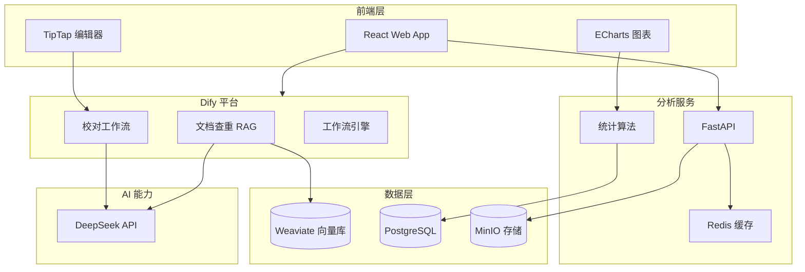

## 产品概述

一个集成化的教育辅助平台，包含文本校对、文档查重、数据分析三大核心功能，面向教育工作者提供试卷题目和答案的智能处理能力。

## 核心功能

### 模块一：文本校对

- 支持试卷题目和学生答案的文本输入或文件上传
- 自动检测错别字、语法错误，并在原文中高亮标注
- 检查题号格式（如：1.、2.、一、二、等）和选项格式（如：A.、B.、C.、D.）
- 提供错误说明和修改建议

### 模块二：文档查重

- 支持 Word 和 PDF 格式文件上传
- 与文档库（约2万份文件）进行比对
- 检测三种重复类型：完全一致、语义相似、核心内容相同
- 展示重复内容详情和相似度评分
- 支持文档库持续更新维护

### 模块三：考试数据分析

- 支持数据库连接和 CSV 文件导入
- 自动生成成绩分布图表（直方图、箱线图）
- 计算题目难度系数、区分度指数
- 测算试卷信度和效度指标
- 提供交互式 Dashboard，支持筛选和钻取

### 系统特性

- 统一 Web 界面，三大功能模块导航切换
- 支持用户管理和操作历史记录
- 响应式设计，适配桌面和平板设备

## 技术选型

### 架构决策

采用 **Dify + Weaviate + DeepSeek** 混合架构：

- **文本校对**：Dify 工作流 + DeepSeek 模型
- **文档查重**：Dify RAG + Weaviate 向量库
- **数据分析**：独立 FastAPI 服务（统计分析需要专业库）

### 前端技术栈

- **框架**: React 18 + TypeScript
- **样式**: Tailwind CSS
- **组件库**: shadcn/ui
- **可视化**: ECharts
- **富文本编辑**: TipTap（用于文本校对标注）
- **文件上传**: react-dropzone

### 后端技术栈

#### Dify 平台（自托管）

- **版本**: Dify 0.6.x+
- **向量数据库**: Weaviate（Dify 内置）
- **大模型**: DeepSeek API
- **文档解析**: Dify 内置解析器（支持 Word/PDF）

#### 数据分析服务（独立 FastAPI）

- **框架**: Python FastAPI
- **数据库**: PostgreSQL
- **数据分析**: pandas、numpy、scipy、scikit-learn
- **任务队列**: Celery + Redis（异步处理大数据集）

### 基础设施

- **部署**: Docker + Docker Compose
- **存储**: MinIO（对象存储）
- **缓存**: Redis
- **服务器**: 腾讯云上海 CVM 或东京 Lighthouse

## 架构设计



## 实现方案

### 文本校对实现（Dify 工作流）

1. **工作流设计**：

- 输入节点：接收文本内容
- LLM 节点：DeepSeek 模型执行错别字检测、语法检查
- 规则节点：正则表达式检查题号/选项格式
- 输出节点：返回标注结果（JSON 格式）

2. **Prompt 设计**：

- 错别字检测：`请检查以下文本中的错别字，返回错误位置和修改建议`
- 语法检查：`请检查以下文本的语法错误，标注错误类型和位置`
- 格式检查：基于规则引擎，匹配题号模式

3. **标注展示**：

- 前端调用 Dify API 获取检测结果
- TipTap 编辑器渲染标注（高亮 + 批注气泡）

### 文档查重实现（Dify RAG）

1. **文档库构建**：

- 上传 2 万份文档到 Dify 知识库
- Dify 自动解析 Word/PDF，提取文本
- Weaviate 存储文档向量

2. **三级查重策略**：

- **完全一致**：MD5 指纹快速比对
- **语义相似**：Weaviate 向量检索（余弦相似度）
- **核心内容相同**：DeepSeek 分析题干和知识点

3. **查重流程**：

- 上传待查文档 → Dify 解析 → 向量检索 → 返回相似文档列表
- 增量更新：监听文档库目录，自动同步到 Dify

### 数据分析实现（FastAPI 服务）

1. **数据导入**：

- CSV: pandas 直接读取
- 数据库: SQLAlchemy 连接（MySQL/PostgreSQL）

2. **统计分析算法**：

- 成绩分布：频数分布、正态性检验（Shapiro-Wilk）
- 题目难度：通过率公式 P = R/N
- 区分度：点二列相关系数 D
- 信度：Cronbach's Alpha 系数
- 效度：内容效度、结构效度分析

3. **可视化接口**：

- 返回 ECharts 配置 JSON
- 支持导出 PNG/PDF

## 目录结构

```
edu-assistant/
├── frontend/                    # 前端应用
│   ├── src/
│   │   ├── components/         # [NEW] 可复用组件
│   │   │   ├── Layout.tsx      # 主布局（导航、侧边栏）
│   │   │   ├── FileUpload.tsx  # 文件上传组件
│   │   │   └── RichEditor.tsx  # 富文本编辑器（标注展示）
│   │   ├── pages/              # [NEW] 页面组件
│   │   │   ├── Proofread.tsx   # 文本校对页面
│   │   │   ├── Dedup.tsx       # 文档查重页面
│   │   │   └── Analysis.tsx    # 数据分析 Dashboard
│   │   └── services/           # [NEW] API 服务封装
│   ├── package.json
│   └── Dockerfile
│
├── analysis-service/            # 数据分析服务
│   ├── app/
│   │   ├── api/                # [NEW] API 路由
│   │   │   └── analysis.py     # 分析接口
│   │   ├── services/           # [NEW] 业务逻辑
│   │   │   └── analyzer.py     # 数据分析服务
│   │   ├── models/             # [NEW] 数据模型
│   │   └── main.py             # 应用入口
│   ├── requirements.txt
│   └── Dockerfile
│
├── dify/                        # Dify 配置
│   ├── docker/                 # [NEW] Docker Compose 配置
│   │   └── docker-compose.yml  # Dify 自托管配置
│   ├── workflows/              # [NEW] 工作流配置
│   │   ├── proofread.yml       # 文本校对工作流
│   │   └── dedup.yml           # 文档查重工作流
│   └── .env                    # [NEW] 环境变量（DeepSeek API Key）
│
├── docker-compose.yml          # [NEW] 容器编排配置
├── .env.example                # [NEW] 环境变量模板
└── README.md                   # [NEW] 项目文档
```

## 实现要点

### Dify 部署要点

- 使用官方 Docker Compose 部署到服务器
- 配置 DeepSeek API Key 作为模型提供商
- Weaviate 向量库自动随 Dify 启动
- 2万份文档分批导入，避免内存溢出

### 性能优化

- 文档查重：Weaviate ANN 检索响应 < 100ms
- 数据分析：Celery 异步处理大数据集
- 前端懒加载：大文件标注分块渲染

### 数据安全

- 文档库文件加密存储
- DeepSeek API Key 安全配置
- 用户上传文件定期清理

## 设计风格

采用现代简约风格，以功能性和易用性为核心。整体设计专业、清晰，适合教育工作者使用。使用 React + TypeScript + Tailwind CSS + shadcn/ui 构建。

## 页面规划

### 1. 首页/工作台

- 顶部导航栏：Logo、三大功能入口、用户头像
- 左侧快捷操作面板：最近使用、快速上传入口
- 中央工作区：三大功能卡片展示，点击进入对应模块
- 底部状态栏：系统状态、文档库更新时间

### 2. 文本校对页面

- 左侧：文本输入区（支持直接输入或文件上传）
- 中央：标注展示区（高亮错误、批注气泡）
- 右侧：错误列表面板（分类统计、修改建议）
- 底部：操作按钮（导出报告、重新检查）

### 3. 文档查重页面

- 顶部：文件上传区（拖拽上传、批量上传）
- 中央：查重结果列表（相似度排序、重复类型标签）
- 详情弹窗：并排对比视图，高亮重复内容
- 右侧：筛选面板（按相似度、重复类型筛选）

### 4. 数据分析 Dashboard

- 顶部：数据源选择（数据库连接/CSV上传）
- 左侧：分析维度导航（成绩分布、难度分析、信效度）
- 中央：图表展示区（ECharts 动态图表）
- 右侧：指标卡片（关键数值、统计摘要）
- 底部：数据表格（支持排序、筛选、导出）

## Agent Extensions

### Skill

- **frontend-design**
- Purpose: 创建高质量的前端界面设计和组件
- Expected outcome: 生成美观、专业的 React 组件和页面布局

- **docx**
- Purpose: 处理 Word 文档的读取和解析
- Expected outcome: 从 .docx 文件中提取文本内容用于查重比对

- **pdf**
- Purpose: 处理 PDF 文档的读取和解析
- Expected outcome: 从 PDF 文件中提取文本内容用于查重比对

### MCP

- **Playwright**
- Purpose: 自动化测试 Web 界面功能
- Expected outcome: 验证前端交互逻辑和用户流程正确性